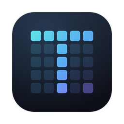

<div align="center">



# TesseraEmu

**A Wii U emulator that is native to Apple Silicon — not ported to it.**

arm64 only · Metal only · macOS 26+ · no MoltenVK · no Rosetta

</div>

---

A *tessera* is the single tile a mosaic is assembled from. The mark is a **T** laid in tesserae,
with one tile still resolving — which is roughly the honest state of any emulator: a picture built
one verified piece at a time.

TesseraEmu began as a hard fork of [Cemu](https://github.com/cemu-project/Cemu) and keeps its
excellent PowerPC recompiler and Latte GPU emulation. What it drops is portability. Upstream Cemu
runs on Windows, Linux and macOS, ships three renderer backends, and reaches Metal on a Mac
through a **translation layer**: Vulkan-over-MoltenVK. Its macOS build long shipped with a
disclaimer about *"degraded performance due to the use of MoltenVK and Rosetta for ARM Macs"* —
the Rosetta half is gone now that upstream builds for arm64, the MoltenVK half is not.

This fork exists to delete those layers rather than apologise for them.

> [!IMPORTANT]
> **Status: early.** It builds, boots and plays. It has been verified against one commercial title
> on one machine (Apple M2, macOS 26.5). Broad game compatibility has **not** been tested and
> should not be assumed. There are no releases yet; build it yourself.

|                         | Upstream Cemu                  | TesseraEmu                       |
| ----------------------- | ------------------------------ | -------------------------------- |
| Architectures           | x86-64 + arm64                 | **arm64 only**                   |
| Renderers               | OpenGL, Vulkan/MoltenVK, Metal | **Metal only**                   |
| Graphics path on a Mac  | Vulkan → MoltenVK → Metal      | **Metal, directly**              |
| Minimum macOS           | 13.4                           | **26.0**                         |
| Thread scheduling       | none                           | **QoS-aware, P/E-core split**    |
| Performance measurement | frame counter                  | **68-counter telemetry harness** |

Roughly **56,000 lines removed**: both non-Metal renderers, the GLSL shader emitter, the entire
x86-64 recompiler backend, glslang, MoltenVK and the Vulkan headers. `precompiled.h` `#error`s on
any target that is not arm64. There is no runtime backend selection because there is nothing left
to select.

---

## Getting started

**You need** an Apple Silicon Mac (M1 or newer), macOS 26.0 or later, and the Xcode 26 command
line tools.

```sh
brew install pkgconf nasm automake autoconf libtool cmake ninja

git clone --recursive https://github.com/PowerBeef/TesseraEmu
cd TesseraEmu

export VCPKG_DEFAULT_BINARY_CACHE="$HOME/.cache/vcpkg"
cmake -S . -B build -G Ninja -DCMAKE_BUILD_TYPE=RelWithDebInfo -DMACOS_BUNDLE=OFF
cmake --build build
```

The first configure builds every dependency from source and takes a while; incremental builds are
around two minutes on an M2. MoltenVK is **not** a dependency — do not install it.

```sh
./bin/TesseraEmu_relwithdebinfo -g /path/to/title.wux
```

TesseraEmu needs `keys.txt` in `~/Library/Application Support/TesseraEmu/`, holding the Wii U
common key and the disc key for each title. These come from your own console and are not
distributed here. Coming from Cemu? Your data directory is migrated automatically and atomically
on first run — [details below](#coming-from-cemu).

See **[BUILD.md](/BUILD.md)** for app bundles, code signing and the full flag list.

---

## What actually changed

Every item below is a specific defect found and fixed, or a platform capability the portable
codebase structurally could not use.

### Bugs fixed along the way

- **Metal renderer heap corruption.** The constructor initialised a `[3][31]` array with a loop
  bound of `4`, writing **248 bytes past the end** on every startup. This was the real cause of a
  long-standing `// HACK: for some reason, this variable ends up being initialized to some garbage
  data` workaround — now deleted along with the bug.
- **16 KB page correctness.** `MemMapper` rounded a mapping's base but not its length, and did no
  rounding at all when unmapping, so releasing a guest range failed silently with `EINVAL` and left
  it writable across a title switch. Apple Silicon's 16 KB pages make this reachable where 4 KB
  pages hid it.
- **JIT I-cache flush.** The AArch64 backend left the emitter cursor short of the end of generated
  code, so `readyRE()` invalidated only part of it — a stale-instruction hazard that surfaces only
  on cold paths, which is the worst kind.
- **Graphic packs corrupting GPU registers**, and sampler LOD bias never being applied at all.

### Written for this hardware

- **ARMv8 AES.** Title and content decryption ran a table-driven software implementation on arm64.
  It now uses the crypto extensions (`AESE`/`AESD`), validated against the FIPS-197 vectors by a
  standalone probe.
- **Thread QoS, and a P/E-core split.** The three guest cores and the GPU command thread run at
  `USER_INTERACTIVE`; recompilation and shader compilation at `UTILITY`. Compile pools are sized
  against the **efficiency cluster** rather than total core count — the previous formula spawned up
  to **17 threads on a 4P+4E machine**, every one of them competing for the P-cores that emulation
  needed.
- **`FSpinlock` → `os_unfair_lock`.** A raw spinlock on an asymmetric-core CPU can burn a P-core
  spinning against a descheduled E-core holder. `os_unfair_lock` tells the kernel who owns the lock.
- **Realtime-safe audio.** The mixer took a mutex on CoreAudio's realtime thread — an unfixable
  priority inversion and a glitch source. Replaced with a lock-free SPSC ring, plus a latency
  request above the device's own floor.
- **Two idle spins removed.** The scheduler stopped burning a P-core on clock reads, and the GPU
  command thread now parks with `wfe` instead of spinning: **−20% total process CPU**
  (205.9% → 165.0%) at an identical frame rate.
- **Native macOS integration.** Screensaver inhibition through `NSProcessInfo` — the SDL version
  was disabled on macOS because it initialised `SDL_INIT_VIDEO` inside a wx app that already owns
  `NSApplication`; SDL input moved off a 5 ms main-thread timer onto its own thread; a native
  `GameController.framework` input provider; Carbon dropped.
- **`NSHighResolutionCapable`.** Without it macOS ran the whole app magnified and handed Metal a
  **half-resolution drawable**.

---

## Measuring instead of guessing

Most emulator optimisation is folklore. This fork ships a **telemetry harness compiled into the
core**: 68 counters across CPU, GPU, memory and accuracy, `__thread`-local and cache-line striped,
gated behind a single branch on a global mask so that a disabled build measurably costs nothing.

```sh
./bin/TesseraEmu_relwithdebinfo -g title.wux --telemetry after.jsonl --telemetry-label after
python3 testing/telemetry-report.py before.jsonl after.jsonl     # aligned by counter name
```

It earns its keep by **contradicting** things that seemed obvious:

- The open world was assumed GPU-bound. It is not. Guest cores sit **~18% busy** and the GPU
  **~38%**, and the frame time is **vsync-quantised** — 49.90 ms is three display refreshes at 60 Hz, so a
  small increase in work costs a whole one-refresh step rather than a proportional slowdown.
- That frame time was traced to a **single guest fence** at one address, spun on **65 million times
  per second**. Parking it removed **99.6% of the spins** and a fifth of all CPU — and moved the
  frame rate *not at all*, which is itself the result.
- Breath of the Wild calls **31 distinct unimplemented imports, 557 times per frame**, 92% of them
  a single alpha-to-coverage function: a measured accuracy target instead of a guess.
- Two rounds of tile-based-deferred-rendering optimisations were designed, measured and
  **rejected**. An earlier conclusion turned out to have been measured on the wrong scene, and is
  recorded as a correction rather than quietly deleted.

Every measurement lands in `testing/golden/baseline.tsv`, alongside a window-only screenshot:

| Scene                 | Commit    | FPS   |
| --------------------- | --------- | ----- |
| Mario Kart 8, title   | `213bcd7` | 60.00 |
| BotW, shrine interior | `2c09604` | 28.63 |
| BotW, Korok Forest    | `5933733` | 20.05 |

Those open-world numbers are not good yet, and they are published rather than hidden. The harness
exists so that the next change to them is attributable.

---

## A hardware reference, not a wiki dump

[`docs/hardware/`](/docs/hardware/) is a 16,000-word, ten-chapter reference on the Wii U's actual
silicon and system software: the Espresso tri-core PowerPC 750CL at 1,243.125 MHz with its paired
singles and locked cache, Latte's R700-derived GPU7, the GX2 write-gather → PM4 → ring-buffer
command path, Cafe OS's *cooperative* scheduler, the audio DSP, and a register of every known
accuracy gap.

Every claim carries a provenance tag: `[SRC file:line]` for something read out of this codebase
(**160 such anchors**, all machine-verified by `tools/docs/check-src-refs.py`), `[HW]` for a
hardware datasheet, `[RE]` for community reverse engineering, `[EST]` for an estimate, and
`[CONFLICT]` where sources disagree. Writing it found and fixed two real bugs.

[`tools/probes/`](/tools/probes/) holds standalone programs that re-verify the platform behaviour
those decisions rest on, so a future macOS can be *re-checked* rather than re-argued. One has
already paid for itself: Apple's documented one-`MAP_JIT`-region-per-process limit turns out not to
be enforced on macOS 26, which downgraded a supposed blocker to an optional optimisation.

---

## Repository layout

| Path                     | What lives there                                       |
| ------------------------ | ------------------------------------------------------ |
| `src/Cafe/HW/Espresso/`  | PowerPC interpreter and the AArch64 recompiler         |
| `src/Cafe/HW/Latte/`     | GPU emulation and the Metal renderer                   |
| `src/Cafe/OS/`           | Cafe OS HLE — `coreinit`, `gx2`, `nn_*`                |
| `src/Cemu/Telemetry/`    | the counter harness                                    |
| `docs/hardware/`         | the hardware reference                                 |
| `docs/porting/`          | staged plans, risk register, per-workstream designs    |
| `tools/probes/`          | standalone platform-behaviour probes                   |
| `tools/icon/`            | renders the app icon from its SVG, reproducibly        |
| `testing/`               | golden-scene capture, telemetry differ, baselines      |

CI builds, signs, verifies and smoke-tests a real `.app` on every push. Internal identifiers still
say `Cemu` — `cemuLog_*`, `CemuConfig`, the `CemuCafe` target — deliberately: renaming them would
be thousands of lines of churn for no user-visible gain.

---

## Coming from Cemu

On first run, `~/Library/Application Support/Cemu` is moved to `.../TesseraEmu` — saves, installed
titles, `keys.txt` and all. Source and destination sit on the same APFS volume, so it is a single
atomic `rename`: no copy, and no window in which the data exists in neither place. If the rename
fails it does **not** fall back to copying; it leaves your data untouched and shows you the exact
command to run. A failed rebrand is an inconvenience, a half-copied 5 GB NAND is data loss.

---

## Relationship to Cemu

This is a hard fork and diverges deliberately. Bug fixes here that are not arm64- or Metal-specific
may be worth porting upstream; the deletions are not.

TesseraEmu is **not affiliated with or endorsed by the Cemu project.** It carries its own name
precisely because MPL-2.0 grants no trademark rights — a modified build should not present itself
as someone else's project. Credit does not move: `LICENSE.txt` is untouched, the About dialog still
credits Exzap and Petergov and links upstream, and the bundle copyright reads *"Cemu Project and
TesseraEmu contributors"* — extended, never substituted.

> [!NOTE]
> **This fork's changes were written with AI assistance (Claude).** Upstream Cemu's contribution
> policy asks that submitted code be written and understood by a human, and explains why: reviewing
> capacity, and the risk of LLM-generated emulation logic being plausible but inaccurate. That
> policy is reasonable and this repository does not try to work around it. **Do not submit these
> changes upstream as-is.** Anything worth contributing back should be re-derived and written by a
> person who understands it.

## License

TesseraEmu, like the Cemu code it derives from, is licensed under the
[Mozilla Public License 2.0](/LICENSE.txt). Copyright in the inherited code remains with its
authors and the licence notices are unchanged. Files in `dependencies/` are covered by the licences
of the original code, as are individual files in `src/` where noted in their headers.

Wii and Wii U are trademarks of Nintendo. TesseraEmu is not affiliated with Nintendo, and no game
code, keys or copyrighted assets are distributed here.

## Upstream links

- [Cemu](https://github.com/cemu-project/Cemu) · [Website](https://cemu.info) · [Compatibility wiki](https://wiki.cemu.info/wiki/Main_Page) · [Discord](https://discord.gg/5psYsup)
